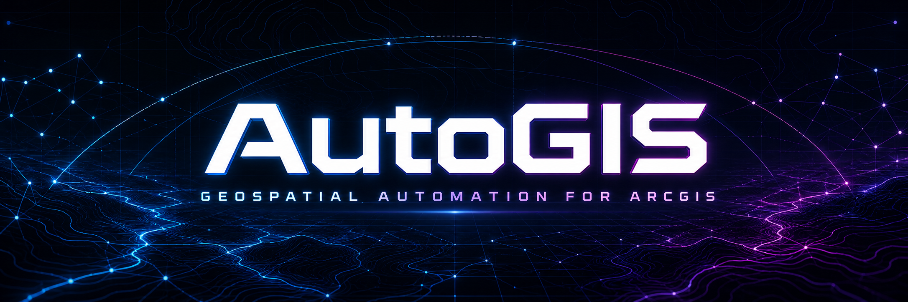
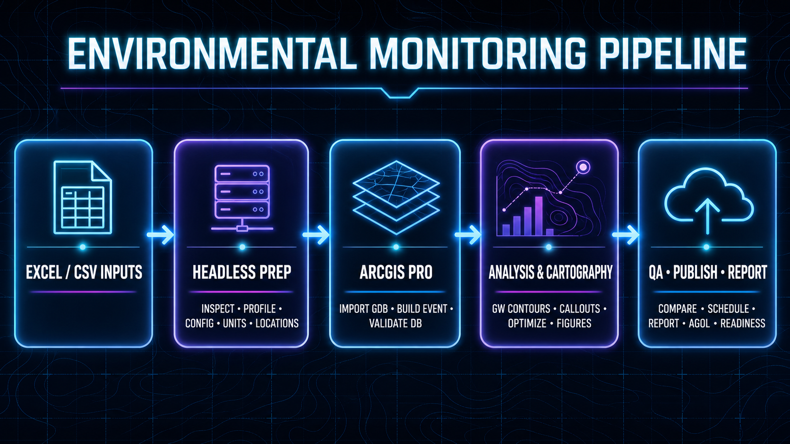
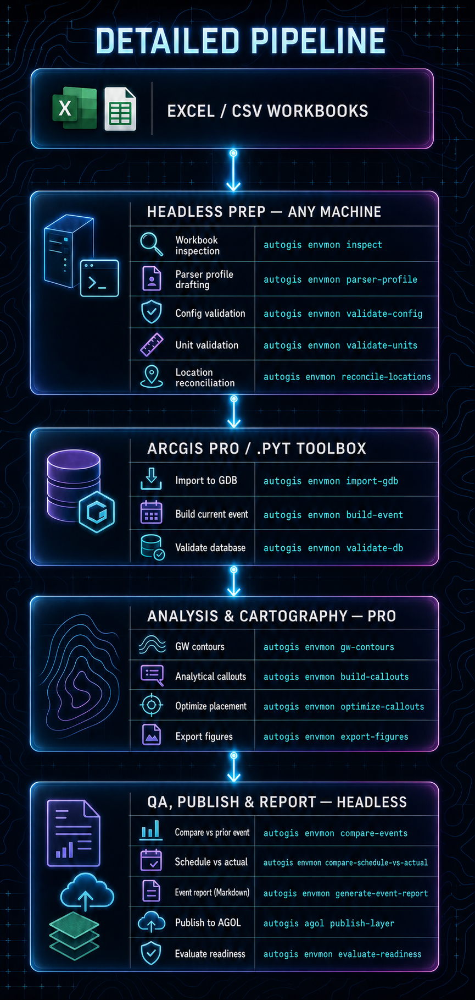
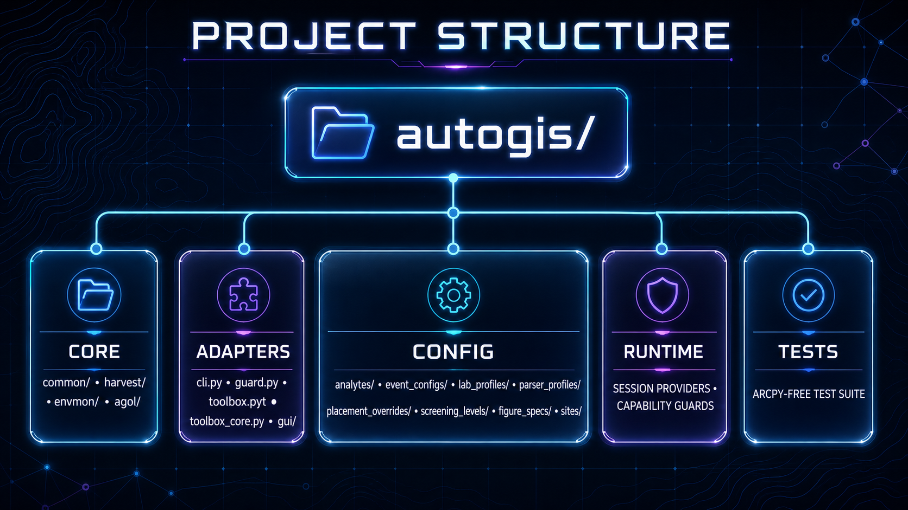
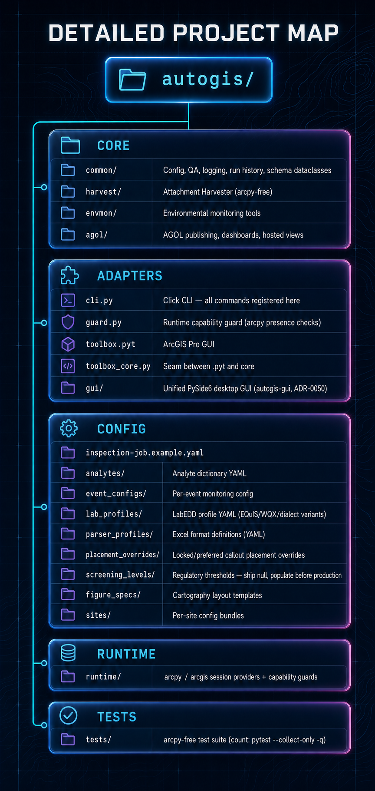

<p align="center">
  
</p>

Automation tools for ArcGIS Pro and ArcGIS Online / Survey123, delivered as a single suite:
the **Attachment Harvester** plus the **Environmental Monitoring tools**, folded into **one
`autogis` package** — one shared core with four adapters (a `click` CLI, an ArcGIS Pro `.pyt`
GUI, a unified PySide6 desktop GUI (`autogis-gui`, ADR-0050), and the importable core itself).

---

## Feature Implementation Tracker

The 79-tool environmental monitoring roadmap is complete **except for the four
deferred §11 AI-assisted tools** — every other catalogued tool ships with a CLI
command, a core module, and tests. The Attachment Harvester is a separate,
fully-shipped domain not counted in the 79 tools.

| Status | Count | Notes |
|--------|------:|-------|
| Fully implemented (CLI command + core module + tests) | 75 | catalogued tools, plus the post-roadmap extras below |
| Foundation laid (partial code, not fully wired) | 0 | |
| **Planned** (spec / plan written, not yet coded) | 0 | BatchEDDImport folded into Tool 2.2 `batch-import-workbooks` — see ADR-0048 |
| **Deferred** (gated, not started) | 4 | the §11 AI-assisted tools — see *Not started* below |
| **Catalog total (§2–11)** | **79** | |

Work has continued past the catalog: the geostatistical group shipped
(ADR-0085/0086) and the post-catalog [production roadmap](docs/production-roadmap.md)
has shipped code for **Phases 1–9**, though the gate isn't fully closed on every
phase — see [CLAUDE.md](CLAUDE.md#post-catalog-production-roadmap) for the
authoritative per-phase gate log. Notably: **Phase 5's gate was met 2026-07-30**
(GUI recipe *load* joined the shipped save/validate/run path, reopening a saved
recipe through the same validated `load_recipe()` / `recipe_to_workflow()` seam
the headless `envmon validate-recipe`/`run-recipe` commands use), **Phase 6's
`.pyt`/CLI run-history logging is still deferred** (gate items 3 & 6), and
Phases 7–9 each have one owner-gated acceptance leg still open (issue #307
tracks Phase 9's). Still unimplemented:
**Phase 10 (portfolio monitoring digest)**, gated behind Phase 9's live-AGOL exit
criteria (ADR-0111), and the four deferred §11 AI tools.

A separate [Survey123 optional add-on roadmap](docs/survey123-add-on-roadmap.md)
defines an opt-in install boundary plus eight phases and four milestones
(ADR-0112). It does not block or reorder the core production sequence above.
This track is no longer pure planning — four phases have shipped code, each
on an explicit user decision rather than the roadmap's own momentum:
**Phase 0 slice A** (lifecycle SampleID contract, ADR-0113, PR #359; the
envelope leg was deliberately deferred to Phase 2), **Phase 1** in full
(`validate-survey-form` + `diff-survey-schema`, both headless with no portal
I/O, ADR-0115, PR #364), **Phase 2 slice 1** (canonical envelope +
`envmon sync-survey123` + the `survey123` extra, ADR-0116 — its live
non-production gate legs are owner-gated), and **Phase 3** (five-source
presence-matrix event reconciliation, `envmon reconcile-event`, ADR-0123 —
its owner-gated exit-gate leg, a sanitized real event reconciling
end-to-end, is a Proposed sign-off item). The rest of Phase 0/2 and Phases
4–7 remain to be started. See
[CLAUDE.md](CLAUDE.md#survey123-optional-add-on-roadmap) for the dated
per-phase gate log.

**Counts are not pinned in this README** — they drift faster than the prose does.
Derive them live:

```bash
ls autogis/core/envmon/*.py | grep -v __init__ | wc -l   # envmon modules
ls autogis/core/agol/*.py   | grep -v __init__ | wc -l   # agol modules
autogis envmon list-tools                                # registered tools + capability metadata
python -m pytest --collect-only -q                       # test count (extras-dependent)
```

The test count is extras-dependent — a `[dev]`-only env collects fewer tests than a
full-extras env. For the per-tool breakdown see
[`docs/ROADMAP_STATUS_2026-06-27.md`](docs/ROADMAP_STATUS_2026-06-27.md); it is a
dated snapshot and the tables below supersede it. Per-batch history lives in
[`docs/adr/`](docs/adr/) and the git log, not here.

<details>
<summary>Fully implemented — headless (CLOUD / HYBRID)</summary>

| Tool | Roadmap # | CLI command | What it does |
|------|-----------|-------------|--------------|
| [InspectWorkbook](autogis/core/envmon/excel_workbook_inspector.py) | 1 | `envmon inspect` | Tool 1: inspect an Excel workbook's structure (headless) |
| [CreateWorkbookParserProfile (draft reader)](autogis/core/envmon/excel_profile_reader.py) | 9 | `envmon parser-profile` | Tool 9: load a parser profile and open it against a workbook (headless) |
| [FigureSpecTemplate](autogis/core/common/config.py) | 10 | `envmon figure-spec` | Tool 10: load and validate a figure spec (headless) |
| [ValidateEnvConfig](autogis/core/envmon/validate_config.py) | 10.2 | `envmon validate-config` | Tool: validate a per-site config bundle (headless) |
| [ManageAnalyteDictionary](autogis/core/envmon/manage_analyte_dict.py) | 3.3 | `envmon manage-analyte-dict` | Tool: validate / inspect the analyte dictionary (read-only, headless) |
| [ManageScreeningLevels](autogis/core/envmon/manage_screening_levels.py) | 3.x | `envmon manage-screening-levels` *(DRAFT pre-production stub — see `envmon list-tools`)* | Validate and inspect the screening levels YAML (headless) |
| [ReconcileSampleLocations](autogis/core/envmon/reconcile_locations.py) | 3.2 | `envmon reconcile-locations` *(HYBRID)* | Tool: pre-flight check that workbook location IDs match the well layer |
| [ValidateAndConvertUnits](autogis/core/envmon/validate_units.py) | 3.5 | `envmon validate-units` | Tool: validate analyte/screening units for convertibility (headless) |
| [EvaluateDuplicateRPD](autogis/core/envmon/evaluate_rpd_qa.py) | 3.6 | `envmon evaluate-rpd-qa` / `envmon evaluate-rpd` | Tool: compute RPD for EDD duplicate samples and emit QA records |
| [ApplyScreeningLevels](autogis/core/envmon/apply_screening.py) | 3.x | `envmon apply-screening` | Tool 3.5: re-evaluate ExceedsScreeningLevel on result records (headless) |
| [CompareMonitoringEvents](autogis/core/envmon/compare_events.py) | 4.7 | `envmon compare-events` | Tool 4.7: compare current vs previous monitoring event per location/analyte |
| [IdentifyMonitoringDataGaps](autogis/core/envmon/data_gaps.py) | 4.10 | `envmon identify-data-gaps` | Tool 4.10: report missing wells/analytes vs an expected schedule |
| [CompareScheduleVsActual](autogis/core/envmon/schedule_vs_actual.py) | — | `envmon compare-schedule-vs-actual` | Compare scheduled monitoring wells/analytes vs actual results (headless) |
| [ProcessLevelLoop](autogis/core/envmon/level_loop.py) | 8.1 | `envmon process-level-loop` | Tool 8.1: differential leveling — adjusted elevations + misclosure QA |
| [ValidateRTKSurvey](autogis/core/envmon/validate_rtk_survey.py) | 8.4 | `envmon validate-rtk-survey` | Validate an RTK survey CSV for precision and fix-type QA; auto-detects headerless PNEZD/PENZD field exports (`--format`/`--extra-columns` to override, ADR-0049) (headless) |
| [DroneGCPCheckpointQA](autogis/core/envmon/drone_checkpoint_qa.py) | 8.7 | `envmon drone-checkpoint-qa` | Tool 11.1: evaluate GCP checkpoint accuracy (headless) |
| [ReconcileSurvey123AndLabResults](autogis/core/envmon/reconcile_survey123_lab.py) | 2.6 | `envmon reconcile-survey123-lab` | Pre-production: reconcile Survey123 field submissions vs lab EDD (headless) |
| [BuildSurvey123XLSFormFromConfig](autogis/core/envmon/survey123_form_builder.py) | 7.1a | `envmon build-survey-form` | Tool 7.1a: generate a Survey123 XLSForm from site/event/analyte config |
| [ValidateSurveyForm](autogis/core/envmon/survey_schema.py) | S123-1.1 | `envmon validate-survey-form` | S123 Phase 1: static XLSForm validation — structure, choices, references, the ADR-0113 SampleID contract, and site/event config cross-checks (headless, no portal, ADR-0115) |
| [DiffSurveySchema](autogis/core/envmon/survey_schema.py) | S123-1.2 | `envmon diff-survey-schema` | S123 Phase 1: classify XLSForm changes vs a baseline form and/or a saved feature-layer spec as safe / review-required / destructive; exits 0/2/3 (headless, no portal, ADR-0115) |
| [SyncSurvey123Submissions](autogis/core/envmon/survey_sync.py) | — | `envmon sync-survey123` | S123 Phase 2: incremental read-only pull of new/changed/deleted submissions into staging envelopes + submissions CSV (live AGOL, `survey123` extra, ADR-0116) |
| [ReconcileMonitoringEvent](autogis/core/envmon/reconcile_event.py) | — | `envmon reconcile-event` | S123 Phase 3: five-source presence-matrix reconciliation (plan/field/COC/lab/GDB); six-outcome taxonomy, exit 2 on residual/needs_review (headless, ADR-0123) |
| [EvaluateReportReadiness](autogis/core/envmon/evaluate_readiness.py) | 9.0b | `envmon evaluate-readiness` | Tool: report-readiness gate — checks required tools ran successfully |
| [ExportAnalyticalSummaryTables](autogis/core/envmon/export_summary_tables.py) | 9.1 | `envmon export-report-format-summary-tables` / `envmon export-summary` | Tool: export Env_AnalyticalResults to formatted report-appendix tables |
| [GenerateMonitoringEventReport](autogis/core/envmon/generate_event_report.py) | — | `envmon generate-event-report` | Assemble a monitoring event report (Markdown or `--format html`, ADR-0083) from CSV tool outputs (post-roadmap extra) |
| [ExportGeoJSONResults](autogis/core/envmon/export_geojson.py) | — | `envmon export-geojson` | Tool 10.3: export analytical results to GeoJSON FeatureCollection (headless) |
| [ValidateScheduleYAML](autogis/core/envmon/validate_schedule.py) | — | `envmon validate-schedule` | Tool 10.2: validate monitoring schedule YAML structure and analyte names |
| [RunHistoryReport / Query](autogis/core/envmon/history_report.py) | 10.1 | `envmon run-history-report` / `envmon run-history` | Tool 10.1: per-location per-analyte history summary across events |
| WriteRunHistory | 10.5 | generically wired at the CLI adapter seam — every `RecordingCommand`/`RecordingGroup` invocation (`cli.py`) writes a `RunRecord` via `RunHistory.write()`, not just `agol promote`'s hand-wired call (see ADR-0054, ADR-0017 status update) | — |
| [PublishEnvironmentalLayersToAGOL](autogis/core/agol/publish.py) | 6.1 | `agol publish-layer` | Publish or overwrite a hosted AGOL feature service |
| [BuildGroundwaterElevationEvent](autogis/core/envmon/build_gwe_event.py) | 4.1 | `envmon build-gwe-event` | Tool 4.1: build the per-event GW-elevation contour layer with exclusion flags |
| [EstimateGWFlowDirection](autogis/core/envmon/estimate_gw_flow_direction.py) | 4.3 | `envmon estimate-gw-flow-direction` (DRAFT) | Tool 4.3: estimate GW flow direction and gradient (DRAFT) from well GWEs |
| [BuildAnalyticalExceedanceEvent](autogis/core/envmon/build_exceedance_event.py) | 4.4 | `envmon build-exceedance-event` | Build exceedance event dataset with ratio/tier enrichment (headless) |
| [GenerateWellTrendCharts](autogis/core/envmon/well_trend_charts.py) | 4.6 | `envmon generate-trend-charts` | Tool 4.6: generate Excel trend-chart workbook from a history CSV (headless) |
| [SelectSoilIntervalsForMapping](autogis/core/envmon/soil_interval_selector.py) | 4.8 | `envmon select-soil-intervals` | Assign display tiers to soil sample intervals and write a mapping CSV (headless) |
| [BuildMaxResultMapDataset](autogis/core/envmon/max_result_dataset.py) | 4.9 | `envmon build-max-result-dataset` | Build max-detected dataset across all events (headless) |
| [GenerateArcadeLabelExpressions](autogis/core/envmon/arcade_label_generator.py) | 5.4 | `envmon generate-arcade-labels` | Tool 5.4: generate Arcade label expressions for ArcGIS Pro layers (headless) |
| [GeneratePythonLabelExpressions](autogis/core/envmon/python_label_generator.py) | 5.4b | `envmon generate-python-labels` | Tool 5.4b: generate Python label expressions for ArcGIS Pro layers (headless) |
| [BuildAnalyticalKey](autogis/core/envmon/build_analytical_key.py) | 5.5 | `envmon build-analytical-key` | Tool 5.5: build the analytical key/legend table (analyte, units, screening, NE) |
| [BuildReportFigurePackage](autogis/core/envmon/report_figure_package.py) | 5.7 | `envmon build-report-package` | Assemble deliverable folder from YAML spec (headless) |
| [RegisterSourceDocuments](autogis/core/envmon/source_registry.py) | 2.5 | `envmon register-source-doc` | Tool 2.5: register a source document in the append-only registry (headless) |
| [BatchImportEnvironmentalWorkbooks](autogis/core/envmon/batch_workbook_importer.py) | 2.2 | `envmon batch-import-workbooks` | Tool 2.2: batch-import EDD workbooks from a manifest CSV or a directory (headless) |
| [MigrateLegacyMonitoringData](autogis/core/envmon/legacy_migrator.py) | 2.4 | `envmon migrate-legacy-data` | Tool 2.4: convert wide-format legacy CSV to long-format result records (headless) |
| [CreateSurvey123SamplingEvent](autogis/core/envmon/create_sampling_event.py) | 2.7 | `envmon create-sampling-event` | Tool 2.7: generate pre-field sampling event plan (headless) |
| [SurveyToWellElevationUpdate](autogis/core/envmon/survey_to_well_elevation.py) | 8.5 | `envmon survey-to-well-elevation` *(registered LOCAL — headless via `--wells-csv`; `--gdb` write path needs arcpy)* | Tool 8.5: push QA-passed RTK survey elevations to MonitoringWells.TOC_ft |
| [RegisterDroneFlight](autogis/core/envmon/register_drone_flight.py) | 8.6 | `envmon register-drone-flight` *(registered LOCAL — headless via `--dry-run`; GDB write path needs arcpy)* | Tool 8.6: register a drone flight from an inventory YAML (ArcGIS Pro) |
| [ImportDroneProducts](autogis/core/envmon/import_drone_products.py) | 8.8 | `envmon validate-drone-products` (headless QA half; the GDB-writing half is LOCAL — see below) | Tool 8.8: validate a drone product manifest CSV (headless) |
| [ImportFieldBoringLogs](autogis/core/envmon/import_boring_logs.py) | 8.0b | `envmon validate-boring-logs` (headless QA half; the GDB-writing half is LOCAL — see below) | Tool 8.0b: validate a boring-log CSV package (headless) |
| [CreateBoringLogDatabase](autogis/core/envmon/create_boring_log_database.py) | 8.0a | `envmon create-boring-log-db` | Tool 8.0a: create (or --validate) the normalized boring-log SQLite database (headless) |
| [GenerateBoringLogPDFs](autogis/core/envmon/boring_log_report.py) | 8.0c | `envmon gen-boring-logs` (Markdown/CSV assembly; PDF conversion is a downstream step) | Tool 8.0c: assemble boring-log Markdown documents from the boring database (headless) |
| [SyncFieldAttachments](autogis/core/envmon/index_field_attachments.py) | 6.5 | `envmon index-field-attachments` (envmon-side index; the AGOL download half is the shipped attachment harvester) | Tool 6.5: index a harvester manifest into AttachmentIndex (headless) |
| [CreateSamplingEventPlan](autogis/core/envmon/sampling_plan.py) | 7.2 | `envmon create-sampling-plan` | Tool 7.2: generate planned sample list and bottle count for an event (headless) |
| [ReconcileFieldAndLabData](autogis/core/envmon/field_lab_reconciler.py) | 7.3 | `envmon reconcile-field-lab` | Tool 7.3: compare field records to lab results, flag mismatches (headless) |
| [GenerateWellInspectionPhotoReport](autogis/core/envmon/well_inspection_photo_report.py) | 7.4 | `envmon generate-inspection-report` (photo embedding needs Pillow — `pip install "autogis[report]"`) | Tool 7.4: per-well inspection photo workbook from harvested attachments + an inspection CSV (headless) |
| [BuildMonitoringReportAppendix](autogis/core/envmon/report_appendix_builder.py) | 9.2 | `envmon build-report-appendix` | Build multi-sheet Excel analytical-data appendix (headless) |
| [GenerateEventChangeLog](autogis/core/envmon/event_changelog.py) | 9.3 | `envmon generate-event-changelog` | Tool 9.3: Generate structured changelog from two monitoring event CSVs |
| [IngestReviewerMapComments](autogis/core/envmon/ingest_reviewer_comments.py) | 9.4 | `envmon ingest-reviewer-comments` | Tool 9.4: ingest reviewer map comments/redlines into a tracked table |
| [GenerateSyntheticEnvWorkbook](autogis/core/envmon/synthetic_workbook.py) | 10.6 | `envmon gen-synthetic-workbook` | Tool 10.6: write a seeded synthetic environmental workbook for parser hardening |
| [RunEnvJobQueue](autogis/core/envmon/job_queue.py) | 10.4 | `envmon generate-job-queue` | Tool 10.4: generate an ordered job-queue JSON from a manifest YAML (headless) |
| [GenerateDraftPlumeBoundary](autogis/core/envmon/draft_plume_boundary.py) | 4.5 | `envmon draft-plume-boundary` *(registered LOCAL — headless without `--gdb`; `--gdb` write path needs arcpy; DRAFT output)* | Tool 4.5: draft plume-extent polygon (convex/concave hull) from exceedance points |
| [RefreshMonitoringDashboardData](autogis/core/agol/dashboard_refresh.py) | 6.4 | `agol refresh-dashboard` | Tool 6.4: push local Dash_* data-mart tables to hosted AGOL layers (HYBRID) |
| [AuditAGOLSchemaAgainstLocalConfig](autogis/core/agol/audit_schema.py) | 6.6 | `agol audit-schema` | Tool 6.6: compare a hosted AGOL feature layer schema against a local spec (HYBRID) |
| [PublishDashboardFromSpec](autogis/core/agol/dashboard_publish.py) | 6.8 | `agol publish-dashboard` | Tool 6.8: compile a YAML dashboard spec and create-or-update the AGOL Dashboard item |
| [AuditAGOLItemDependencies](autogis/core/agol/audit_dependencies.py) | 6.9 | `agol audit-dependencies` | Tool 6.9: find items that reference/depend on an AGOL item (HYBRID) |
| [PromoteAGOLDataBetweenStages](autogis/core/agol/promote.py) | 6.10 | `agol promote` | Tool 6.10: promote an AGOL layer's data between DEV/QA/PROD stages |
| [UpdateWellElevationsFromLevelLoop](autogis/core/envmon/level_loop.py) | 8.2 | `envmon update-well-elevations` *(registered LOCAL — headless via `--wells-csv`; `--gdb` write path needs arcpy)* | Tool 8.2: push a closed level-loop run's elevations to MonitoringWells.TOC_ft |
| [ExportContoursForCivil3D](autogis/core/envmon/civil3d_points.py) | 8.2 | `envmon export-civil3d` | Tool 8.2: PNEZD point CSV + projection note + `--landxml` CgPoints export, all headless (ADR-0088); the `.pyt` tool exports an existing Pro TIN as a triangulated LandXML surface (ADR-0089) |
| [GenerateSubsurfaceProfileFromBorings](autogis/core/envmon/subsurface_profile.py) | — | `envmon generate-subsurface-profile` | Render a subsurface profile figure from borings projected onto a line (headless; `profile` extra for matplotlib) |
| [DraftLithologyFromScan](autogis/core/envmon/draft_lithology_from_scan.py) | — | `envmon draft-lithology-from-scan` (DRAFT, unreviewed OCR output) | Draft a lithology CSV from a scanned boring log via a Table-Transformer + TrOCR pipeline (ADR-0074, headless; `ocr` extra) |
| [UpdateAGOLWebMapFromFigureSpec](autogis/core/agol/webmap.py) | 6.3 | `agol update-webmap` (visibility + definition-query config only; no popup/label/symbology in the canonical FigureSpec) | Tool 6.3: push a figure spec's display config into an AGOL web map |
| [CreateHostedViewsForStakeholders](autogis/core/agol/hosted_views.py) | 6.11 | `agol create-views` | Tool 6.11: create/update audience-specific hosted views (sensitive-field leak is blocking) |
| [SyncAGOLFeatureLayerToGDB](autogis/core/agol/sync_layer.py) | 6.2 | `agol sync-to-gdb` *(registered LOCAL — headless via `--out-csv`; `--gdb` upsert path needs arcpy; attribute sync only — attachments stay with `autogis harvest` + `envmon index-field-attachments`)* | Tool 6.2: download hosted feature layer edits into the local FGDB |

Post-roadmap extras (not counted in the 79-tool catalog):

| Tool | CLI command | What it does |
|------|-------------|--------------|
| [VerifyReportPackage](autogis/core/envmon/report_package_verifier.py) | `envmon verify-report-package` | Verify package paths and SHA-256 manifest hashes; detect missing, modified, extra, duplicate, non-portable, named-stream, hard-link, traversal, and reparse-link entries (headless) |
| [GWLevelSummary](autogis/core/envmon/gw_level_summary.py) | `envmon gw-level-summary` | Tool 5.1: per-well GW level/DTW/trend summary from elevation history |
| [BuildComplianceSummaryTable](autogis/core/envmon/compliance_summary.py) | `envmon build-compliance-table` | Build cross-event compliance summary matrix + detail workbook (headless) |
| [ExportEnvDataToGeoPackage](autogis/core/envmon/geopackage_exporter.py) | `envmon export-geopackage` | Export envmon data to OGC GeoPackage (stdlib sqlite3, headless) |
| [ExportLabAnalyticalRequest](autogis/core/envmon/lab_request_exporter.py) | `envmon export-lab-request` | Generate lab analytical request workbook from sampling event plan (headless) |
| [GenerateQCSampleSummary](autogis/core/envmon/qc_sample_summary.py) | `envmon generate-qc-summary` | Generate QC data summary workbook (blanks, spikes, duplicates) (headless) |
| [GenerateRegulatorySubmissionTables](autogis/core/envmon/regulatory_table_builder.py) | `envmon generate-reg-tables` | Build regulatory submission pivot table workbook (headless, openpyxl) |
| [GenerateSiteNarrative](autogis/core/envmon/site_narrative_generator.py) | `envmon generate-site-narrative` | Generate template-driven site monitoring narrative (headless) |
| [TransformLandXMLSurface](autogis/core/envmon/landxml_transform.py) | `envmon transform-landxml` | ArcGIS Project-style transformation of one selected LandXML TIN from a geographic or projected authority-coded CRS to a projected EPSG CRS, with extent-ranked or explicitly selected geographic transformation and automatic or custom Z scaling (headless; `landxml` extra; also Tool 8.2a in the `.pyt` toolbox) |
| [ListAvailableEnvTools](autogis/core/envmon/tool_registry.py) | `envmon list-tools` | List available envmon tools with capability metadata (headless) |
| [MergeEventResults](autogis/core/envmon/event_results_merger.py) | `envmon merge-event-results` | Merge multiple event result CSVs into one long-format file (headless) |
| [ValidateFieldDataCompleteness](autogis/core/envmon/field_completeness_validator.py) | `envmon validate-field-completeness` | Compare sampling plan vs. lab results for completeness (headless) |
| [InitSite](autogis/core/envmon/init_site.py) | `envmon init-site` | Production-roadmap Phase 3: scaffold a new site's config skeleton (site/event/parser/figure) from versioned templates, flagging unverified anchors and missing regulatory content (headless, ADR-0102) |
| [NewFlightYaml](autogis/core/envmon/register_drone_flight.py) | `envmon new-flight-yaml` | Tool 8.6a: write a ready-to-edit drone flight inventory YAML for `register-drone-flight` (headless, ADR-0100) |
| [ExportComparisonExcel](autogis/core/envmon/export_comparison_excel.py) | `envmon export-comparison-excel` | Tool 4.8: export comparison results to a formatted Excel workbook (headless) |
| [DraftParserProfileFromWorkbook](autogis/core/envmon/excel_workbook_inspector.py) | `envmon draft-parser-profile` | Tool 2.1: inspect a workbook and write a draft parser profile YAML (headless) |
| [DraftEDDProfile](autogis/core/envmon/edd_profile_draft.py) | `envmon draft-edd-profile` | Tool 2.3a: inspect a sample lab EDD and write a draft LabEDD profile YAML (headless) |
| [ValidateLabProfile](autogis/core/envmon/edd_profile.py) | `envmon validate-lab-profile` | Tool 2.3b: validate a LabEDD profile YAML is well-formed (headless) |
| [RTKControlCheckReport](autogis/core/envmon/rtk_control_check.py) | `envmon rtk-control-check` | Compare RTK-surveyed control shots to published benchmarks (headless) |
| [GeneratePortfolioMetrics](autogis/core/envmon/portfolio_metrics.py) | `envmon portfolio-metrics` | Roll up per-site report readiness across a multi-site run history |
| [EventStatus](autogis/core/envmon/event_status.py) | `envmon event-status` | Roadmap Phase 2: classify each event artifact current/stale/missing/failed/awaiting-review from input hashes + run/registry ledgers, with stable exit codes (`--accept` records the baseline; ADR-0093) |
| [EvaluateGroundwaterSurfaceModels](autogis/core/envmon/evaluate_gw_models.py) | `envmon evaluate-gw-models` | Cross-validate interpolation model predictions against observed values |
| [ExportSurveyToCADGIS](autogis/core/envmon/export_survey_cad.py) | `envmon export-survey-cad` | Export RTK survey points to feature-code-mapped CSV/GeoJSON/LandXML layers (headless; `--landxml` per ADR-0071) |
| [GenerateWellInspectionReports](autogis/core/envmon/well_inspection_report.py) | `envmon well-inspection-report` | Generate well inspection reports (Markdown or `--format html` with a photo grid, ADR-0083) + a site summary (headless) |
| [DownloadOpenTopographyDEM](autogis/core/envmon/opentopo.py) | `envmon download-dem` | Download an OpenTopography DEM GeoTIFF for an AOI (HYBRID — headless CLI + `.pyt` add-to-map; `opentopo` extra for non-WGS84 reprojection) |
| [ValidateWorkflowRecipe](autogis/adapters/recipe_workflow.py) | `envmon validate-recipe` | Validate a saved linear workflow-recipe YAML (headless, ADR-0103) |
| [RunWorkflowRecipe](autogis/adapters/recipe_workflow.py) | `envmon run-recipe` | Run a saved workflow recipe headlessly, one step at a time (ADR-0104) |
| [ChainOfCustodyLifecycle](autogis/core/envmon/custody.py) | `envmon coc` (`generate` / `advance` / `reconcile` / `status`) | Production Phase 6: electronic chain-of-custody state machine (draft → released → lab-received → reconciled) with a per-transition audit trail and planned-vs-received reconcile (headless, ADR-0107) |
| [LongitudinalLabQATrends](autogis/core/envmon/lab_qa_trends.py) | `envmon lab-qa-trends` | Production Phase 7: longitudinal laboratory-QA trending (recovery + blank) across events, with cited, configurable thresholds (headless, ADR-0108) |
| [OutboundWQXExport](autogis/core/envmon/wqx_outbound.py) | `envmon export-wqx` (DRAFT) | Production Phase 8: map canonical analytical results to a WQX/regulatory submission, with a rejections file and provenance (headless, DRAFT — inherits `wqx.yaml`'s draft status, ADR-0109) |
| [FieldMapsSyncPreflight](autogis/core/agol/fieldmaps_preflight.py) | `agol fieldmaps-preflight` | Tool 7.5 / Production Phase 9: read-only Field Maps sync preflight report — surfaces conflicts and schema drift before a sync (headless, ADR-0111) |

</details>

<details>
<summary>Fully implemented — ArcGIS Pro (LOCAL)</summary>

| Tool | Roadmap # | CLI command (arcpy-guarded; primary UI is the `.pyt`) | What it does |
|------|-----------|--------------------------------------------------------|--------------|
| [ImportLabEDD](autogis/core/envmon/edd_importer.py) | 2.3 | `envmon import-edd` | Tool 2.3: import a lab EDD CSV/XLSX into the envmon GDB (needs ArcGIS Pro); profile-driven formats include EQuIS (`equis_xls`, ADR-0082) and WQX (`wqx_csv`, ADR-0080) alongside the original layout |
| [ImportToGDB](autogis/core/envmon/import_to_gdb.py) | 2/3 | `envmon import-gdb` | Tool 2: import a workbook into the file geodatabase (ArcGIS Pro) |
| [BuildCurrentEvent](autogis/core/envmon/build_current_event.py) | 4 | `envmon build-event` | Tool 3: build the current-event feature data (ArcGIS Pro) |
| [BuildAnalyticalCallouts](autogis/core/envmon/build_figure_dataset.py) | 5.1 | `envmon build-callouts` | Tool 4: generate callout feature classes (ArcGIS Pro) |
| [OptimizeCalloutPlacement](autogis/core/envmon/callout_collision.py) | 5.2 | `envmon optimize-callouts` (honest alias for `build-callouts --use-hull-collision`, ADR-0070) | Tool 5.2: hull-collision callout placement, folded into BuildCallouts (ArcGIS Pro) |
| [ManageCalloutPlacementOverrides](autogis/core/envmon/manage_callout_overrides.py) | 5.3 | `envmon manage-callout-overrides` (list/clear/lock/unlock) | Tool 5.3: CRUD for locked/preferred callout placement overrides (ArcGIS Pro) |
| [GenerateDraftGWContours](autogis/core/envmon/groundwater_contours.py) | 4.2 | `envmon gw-contours` | Tool 5: build groundwater contours (ArcGIS Pro) |
| [ExportFigures](autogis/core/envmon/export_figures.py) | 6 | `envmon export-figures` | Tool 6: export figure layouts (ArcGIS Pro) |
| [FullPipeline](autogis/core/envmon/import_to_gdb.py) | 7 | `envmon full-pipeline` | Tool 7: run the full import-to-figures pipeline (ArcGIS Pro) |
| [ValidateEnvironmentalDatabase](autogis/core/envmon/validate_database.py) | 3.1 | `envmon validate-db` | Tool 8: validate the GDB schema and cross-table integrity (ArcGIS Pro) |
| [UpgradeEnvMonitoringGDBSchema](autogis/core/envmon/upgrade_schema.py) | 10.3 | `envmon upgrade-schema` | Upgrade a file GDB to the current envmon schema version (ArcGIS Pro) |
| [ExportEventDatabaseSnapshot](autogis/core/envmon/export_snapshot.py) | 9.0a | `envmon export-snapshot` | Freeze a GDB snapshot for a reporting event (ArcGIS Pro) |
| [ImportRTKSurveyPoints](autogis/core/envmon/import_rtk_survey.py) | 8.3 | `envmon import-rtk-survey` | Import RTK survey CSV into SurveyPoints_Raw/QA, incl. PDOP/Satellites from headerless extended-layout exports (ArcGIS Pro) |
| [RouteSurvey123Submission](autogis/core/envmon/normalize_survey123.py) | 7.1b | `envmon route-survey123` | Route Survey123 field submissions into the GDB (ArcGIS Pro) |
| [ImportDroneProducts](autogis/core/envmon/import_drone_products.py) | 8.8 | `envmon import-drone-products` (GDB-writing half; see `validate-drone-products` above) | Tool 8.8: import drone deliverables to raster catalog + GCP table (ArcGIS Pro) |
| [ImportFieldBoringLogs](autogis/core/envmon/import_boring_logs.py) | 8.0b | `envmon import-boring-logs` (GDB-writing half; see `validate-boring-logs` above) | Tool 8.0b: import a boring-log CSV package into the GDB (ArcGIS Pro) |
| [BuildDashboardDataMart](autogis/core/envmon/dashboard_data_mart.py) | 6.7 | `envmon build-dashboard-data-mart` | Tool 6.7: truncate + repopulate the Dash_* mart tables and optionally emit `--export-dir` JSON for `agol refresh-dashboard` (ArcGIS Pro) |
| [BuildCADExportPackage](autogis/core/envmon/cad_layer_map.py) | 8.9 | `envmon build-cad-package` (guards + redirects to the `.pyt` toolbox) | Tool 8.9: export GIS layers to DWG/DXF with mapped CAD layer name/color/linetype on scratch copies, plus a projection note and mapping report (ADRs 0088–0089) |
| [DEMConditioningPipeline](autogis/core/envmon/dem_conditioning.py) | — | `envmon condition-dem` (config validated headless; guards + redirects to the `.pyt` toolbox) | Void-fill/smooth a drone flight's DEM and derive hillshade/slope/contours (ArcGIS Pro) |
| [CompareDroneSurfaces](autogis/core/envmon/compare_drone_surfaces.py) | — | `envmon compare-drone-surfaces` (args validated headless; guards + redirects to the `.pyt` toolbox) | Raster-diff a drone DEM against a prior flight or a LandXML design surface (ArcGIS Pro) |
| [UpdateLayoutDynamicText](autogis/core/envmon/layout_manager.py) | 5.8 | `envmon update-layout-text` (CLI-first per ADR-0039; wraps the shipped `layout_manager.update_layout_text`) | Tool 5.8: update APRX layout text elements from a YAML values file (ArcGIS Pro) |
| [BuildFieldMapsMonitoringProject](autogis/core/envmon/fieldmaps_plan.py) | 7.1 | `envmon build-fieldmaps` (CLI-first per ADR-0039; plan is arcpy-free + headless via `--dry-run`, GDB provisioning needs arcpy; publish via `agol publish-layer`) | Tool 7.1: create/refresh the Field Maps monitoring layers for field crews (ArcGIS Pro) |
| [GenerateSiteMapSeries](autogis/core/envmon/map_series_plan.py) | 5.6 | `envmon gen-map-series` (CLI-first per ADR-0039; planner + `--dry-run` are arcpy-free; export loop replays the ExportFigures chain) | Tool 5.6: batch figure-packet exporter across sites/events (ArcGIS Pro) |
| [RunFieldToGroundwaterModelPipeline](autogis/core/envmon/gw_model_pipeline.py) | Phase 5 | `envmon run-gw-model-pipeline` | Phase-5 slice 1: multi-model (TIN/IDW) draft GW contours with leave-one-out cross-validation and a `GW_ModelRun` registry entry (ArcGIS Pro, ADR-0085) |
| [BuildGroundwaterSurfaceModel](autogis/core/envmon/gw_model_pipeline.py) | Phase 5 | `envmon approve-gw-model` (approval verb; the model runs via `run-gw-model-pipeline`) | Phase-5 slice 1: record the approved GW surface model against a `GW_ModelRun` (ArcGIS Pro; ADR-0085 decision 3) |
| [BuildAnalyticalConcentrationSurface](autogis/core/envmon/concentration_surface.py) | Phase 5 | `envmon build-conc-surface` (DRAFT output) | Phase-5 slice 2: DRAFT interpolated concentration surface with EBK, an uncertainty raster, and an explicit nondetect policy (ArcGIS Pro, ADR-0086) |
| [QualifyArcGISPro](autogis/adapters/qualification.py) | — | `envmon qualify` | Production Phase 1: qualify the installed ArcGIS Pro runtime and `.pyt` toolbox against the supported baseline (ArcGIS Pro, ADR-0091) |

</details>

<details>
<summary>Foundation laid / partial</summary>

| Tool | Roadmap # | What exists | What's missing |
|------|-----------|-------------|----------------|
| *(none currently)* | | | |

Note: BuildGroundwaterElevationEvent (4.1), BuildAnalyticalExceedanceEvent (4.4),
UpdateWellElevationsFromLevelLoop (8.2), CreateHostedViewsForStakeholders (6.11, the
last of the Dashboard-consuming-tools group), and UpdateLayoutDynamicText (5.8) have
all shipped (see *Fully implemented* above).

</details>

<details>
<summary>Planned — spec and/or implementation plan written, not yet coded</summary>

Specs live in [`docs/superpowers/specs/`](docs/superpowers/specs/);
plans in [`docs/superpowers/plans/`](docs/superpowers/plans/).

**Post-roadmap / infrastructure** (not counted in the 79-tool catalog)

BatchEDDImport is no longer a separate planned tool — it was **folded into
Tool 2.2 `batch-import-workbooks`** (2026-07-03): the existing command gained
an alternate `--edd-dir`/`--profile`/`--site`/`--pattern` input mode instead
of a new module/command (ADR-0048; the 2026-06-28 plan is superseded).

Note: SessionCoordinationTier1 has shipped (`.claude/coordination/coord_cli.py`,
`hook_check.py`, `registry.py` — see the *Worktrees & session coordination* section of
`CLAUDE.md`); it is separate infrastructure tooling, not an `autogis envmon` CLI command, so it
is not carried in the tables above. A remediation follow-up (parallel-session edge cases) is
still design-only.

</details>

<details>
<summary>Not started — no spec or implementation plan</summary>

**Within the 79-tool catalog, only the four deferred §11 AI tools remain unstarted.**
Every other catalogued tool has shipped — SyncAGOLFeatureLayerToGDB (6.2) was the
last of the ordinary roadmap (2026-07-03, `agol sync-to-gdb`, ADR-0044), and the
geostatistical group has since shipped as well (see below).

Outside the catalog, one post-catalog phase is still outstanding: **Phase 10 —
portfolio monitoring digest** ([`docs/production-roadmap.md`](docs/production-roadmap.md)),
which has no implementation and is gated behind Phase 9's live-AGOL exit criteria
(ADR-0111).

ValidateSurveyDeliverable needs no new code: it was folded into the shipped
`ValidateRTKSurvey` (8.4) — see
[`docs/superpowers/specs/2026-06-28-roadmap-duplicate-tools-fold-decision.md`](docs/superpowers/specs/2026-06-28-roadmap-duplicate-tools-fold-decision.md).

**AI-assisted (§11) — DEFERRED, GATE CLOSED:** AIDraftParserProfile,
AIExplainQAReport, AIDraftFigureSpec, AIMapReviewChecklist — the owner reviewed
current readiness findings on 2026-08-01 and chose not to reopen the gate. This
is a separate future development phase, **not a backlog to pick from**: reconsider
it only through an explicit phase-gate decision for a demonstrated deterministic-
tool gap or unmet user need. See `CLAUDE.md` for the standing policy.

**Conditional / geostatistical (Phase 5) — GATE CLOSED, SHIPPED.** The required
architecture review landed as **ADR-0085** (Accepted 2026-07-16) and both slices merged:
slice 1 (TIN/IDW pipeline, `GW_ModelRun` registry, plume clip) and slice 2 (EBK,
uncertainty raster, concentration surface, nondetect policy — **ADR-0086**, Accepted
2026-07-24). All 3 tools now ship as LOCAL commands — `run-gw-model-pipeline`,
`approve-gw-model`, `build-conc-surface` — listed under *Fully implemented — ArcGIS Pro*
above. One residual QA leg is outstanding: the live-Pro EBK/Geostatistical Analyst
acceptance run, deliberately decoupled from acceptance and pending owner availability
(workflow + synthetic data: [`docs/qa/geostat-live-pro-qa.md`](docs/qa/geostat-live-pro-qa.md)).
The other 6 tools originally reviewed as conditional shipped earlier (issue #167,
ADR-0061) — DEMConditioningPipeline, CompareDroneSurfaces and
GenerateSubsurfaceProfileFromBorings among them, which turned out to be
drone-raster/geotech-graphics work rather than geostatistical modeling.
`docs/CONDITIONAL_TOOLS_REVIEW.md` and `docs/HANDOFF-2026-07-15-geostat.md` describe the
pre-acceptance state and are historical.

</details>

Full roadmap detail: [`docs/ROADMAP_STATUS_2026-06-27.md`](docs/ROADMAP_STATUS_2026-06-27.md) ·
[`docs/IMPLEMENTATION_ROADMAP_PRIORITIZED.md`](docs/IMPLEMENTATION_ROADMAP_PRIORITIZED.md)

---

## Architecture

### One core, four adapters

- **Shared substrate:** `autogis.core.common` — config validation, QA reporting, logging, run
  history, and the schema dataclass package
- **Domain modules:** `autogis.core.harvest` (Attachment Harvester), `autogis.core.envmon`
  (environmental monitoring), and `autogis.core.agol` (AGOL publishing) sit on top of common
- **Four adapters:** the importable `autogis.core` library surface, `autogis.adapters.cli`
  (Click CLI), `autogis.adapters.toolbox.pyt` (ArcGIS Pro GUI), and
  `autogis.adapters.gui` (`autogis-gui`, a unified PySide6 desktop GUI that introspects the
  CLI's command tree and can drive both headless and LOCAL tools — ADR-0050). The three user
  interfaces construct and validate the *same* config dataclasses and call the *same* core
  functions — the interfaces cannot drift

### Design invariants

- **Arcpy-free core** (ADR-0002): importing any `core` module succeeds without `arcpy` or `arcgis`
  installed. Both are lazy-imported inside function bodies. `arcgis` is the optional `cloud` extra;
  `arcpy` ships with ArcGIS Pro and is never a pip dependency.
- **Config as code** (ADR-0009): all configuration through validated dataclasses; no magic strings
  or config drift between adapters.
- **Idempotent imports**: re-running any import tool does not duplicate data.
- **Source-cell traceability**: every analytical result links back to its originating Excel row/column.

---

## Runtime Matrix

Every tool declares a runtime class; the suite enforces it at the adapter layer. Runtime classes
and backing modules below are taken directly from `autogis/runtime/capabilities.py` and
`autogis/adapters/cli.py`.

### Headless (CLOUD / HYBRID) — run anywhere without ArcGIS Pro

A few commands below are registered `LOCAL` (arcpy required) yet still have a
genuinely headless invocation — the note column says which flag combination
avoids arcpy. They're listed here for that reason, but `envmon list-tools`
correctly reports them as `LOCAL`, since the registry classifies by command,
not by flag.

| Command | Runtime | Backing module |
|---------|---------|----------------|
| `autogis harvest` | HYBRID | `core/harvest/` |
| `autogis envmon inspect` | CLOUD | `core/envmon/excel_workbook_inspector.py` |
| `autogis envmon parser-profile` | CLOUD | `core/envmon/excel_profile_reader.py` |
| `autogis envmon figure-spec` | CLOUD | `core/common/config.py` (`FigureSpec`) |
| `autogis envmon validate-config` | CLOUD | `core/envmon/validate_config.py` |
| `autogis envmon manage-analyte-dict` | CLOUD | `core/envmon/manage_analyte_dict.py` |
| `autogis envmon manage-screening-levels` | DRAFT | `core/envmon/manage_screening_levels.py` |
| `autogis envmon reconcile-locations` | HYBRID | `core/envmon/reconcile_locations.py` (`--wells-csv` headless; `--gdb` guards + redirects to the `.pyt` ReconcileSampleLocations) |
| `autogis envmon validate-units` | CLOUD | `core/envmon/validate_units.py` |
| `autogis envmon evaluate-rpd-qa` | CLOUD | `core/envmon/evaluate_rpd_qa.py` |
| `autogis envmon evaluate-rpd` | CLOUD | `core/envmon/evaluate_rpd.py` |
| `autogis envmon apply-screening` | CLOUD | `core/envmon/apply_screening.py` |
| `autogis envmon compare-events` | CLOUD | `core/envmon/compare_events.py` |
| `autogis envmon identify-data-gaps` | CLOUD | `core/envmon/data_gaps.py` |
| `autogis envmon compare-schedule-vs-actual` | CLOUD | `core/envmon/schedule_vs_actual.py` |
| `autogis envmon validate-schedule` | CLOUD | `core/envmon/validate_schedule.py` |
| `autogis envmon process-level-loop` | CLOUD | `core/envmon/level_loop.py` |
| `autogis envmon validate-rtk-survey` | CLOUD | `core/envmon/validate_rtk_survey.py` |
| `autogis envmon drone-checkpoint-qa` | CLOUD | `core/envmon/drone_checkpoint_qa.py` |
| `autogis envmon reconcile-survey123-lab` | CLOUD | `core/envmon/reconcile_survey123_lab.py` |
| `autogis envmon build-survey-form` | CLOUD | `core/envmon/survey123_form_builder.py` |
| `autogis envmon validate-survey-form` | CLOUD | `core/envmon/survey_schema.py` |
| `autogis envmon diff-survey-schema` | CLOUD | `core/envmon/survey_schema.py` |
| `autogis envmon sync-survey123` | CLOUD (AGOL auth; `survey123` extra) | `core/envmon/survey_sync.py` |
| `autogis envmon reconcile-event` | CLOUD | `core/envmon/reconcile_event.py` |
| `autogis envmon evaluate-readiness` | CLOUD | `core/envmon/evaluate_readiness.py` |
| `autogis envmon export-summary` | CLOUD | `core/envmon/export_summary.py` |
| `autogis envmon export-report-format-summary-tables` | CLOUD | `core/envmon/export_summary_tables.py` |
| `autogis envmon generate-event-report` | CLOUD | `core/envmon/generate_event_report.py` |
| `autogis envmon export-geojson` | CLOUD | `core/envmon/export_geojson.py` |
| `autogis envmon run-history-report` | CLOUD | `core/envmon/history_report.py` |
| `autogis envmon run-history` | CLOUD | `core/common/run_history.py` |
| `autogis agol publish-layer` | — (AGOL auth) | `core/agol/publish.py` |
| `autogis envmon build-gwe-event` | CLOUD | `core/envmon/build_gwe_event.py` |
| `autogis envmon gw-level-summary` | CLOUD | `core/envmon/gw_level_summary.py` |
| `autogis envmon estimate-gw-flow-direction` | CLOUD | `core/envmon/estimate_gw_flow_direction.py` (DRAFT) |
| `autogis envmon build-exceedance-event` | CLOUD | `core/envmon/build_exceedance_event.py` |
| `autogis envmon generate-trend-charts` | CLOUD | `core/envmon/well_trend_charts.py` |
| `autogis envmon select-soil-intervals` | CLOUD | `core/envmon/soil_interval_selector.py` |
| `autogis envmon export-comparison-excel` | CLOUD | `core/envmon/export_comparison_excel.py` |
| `autogis envmon build-max-result-dataset` | CLOUD | `core/envmon/max_result_dataset.py` |
| `autogis envmon generate-arcade-labels` | CLOUD | `core/envmon/arcade_label_generator.py` |
| `autogis envmon generate-python-labels` | CLOUD | `core/envmon/python_label_generator.py` |
| `autogis envmon build-analytical-key` | CLOUD | `core/envmon/build_analytical_key.py` |
| `autogis envmon build-report-package` | CLOUD | `core/envmon/report_figure_package.py` |
| `autogis envmon verify-report-package` | CLOUD | `core/envmon/report_package_verifier.py` |
| `autogis envmon register-source-doc` | CLOUD | `core/envmon/source_registry.py` |
| `autogis envmon batch-import-workbooks` | CLOUD | `core/envmon/batch_workbook_importer.py` |
| `autogis envmon migrate-legacy-data` | CLOUD | `core/envmon/legacy_migrator.py` |
| `autogis envmon draft-parser-profile` | CLOUD | `core/envmon/excel_workbook_inspector.py` |
| `autogis envmon draft-edd-profile` | CLOUD | `core/envmon/edd_profile_draft.py` |
| `autogis envmon validate-lab-profile` | CLOUD | `core/envmon/edd_profile.py` |
| `autogis envmon create-sampling-plan` | CLOUD | `core/envmon/sampling_plan.py` |
| `autogis envmon reconcile-field-lab` | CLOUD | `core/envmon/field_lab_reconciler.py` |
| `autogis envmon build-report-appendix` | CLOUD | `core/envmon/report_appendix_builder.py` |
| `autogis envmon generate-event-changelog` | CLOUD | `core/envmon/event_changelog.py` |
| `autogis envmon ingest-reviewer-comments` | CLOUD | `core/envmon/ingest_reviewer_comments.py` |
| `autogis envmon gen-synthetic-workbook` | CLOUD | `core/envmon/synthetic_workbook.py` |
| `autogis envmon generate-job-queue` | CLOUD | `core/envmon/job_queue.py` |
| `autogis envmon build-compliance-table` | CLOUD | `core/envmon/compliance_summary.py` |
| `autogis envmon export-geopackage` | CLOUD | `core/envmon/geopackage_exporter.py` |
| `autogis envmon export-lab-request` | CLOUD | `core/envmon/lab_request_exporter.py` |
| `autogis envmon generate-qc-summary` | CLOUD | `core/envmon/qc_sample_summary.py` |
| `autogis envmon generate-reg-tables` | CLOUD | `core/envmon/regulatory_table_builder.py` |
| `autogis envmon generate-site-narrative` | CLOUD | `core/envmon/site_narrative_generator.py` |
| `autogis envmon list-tools` | CLOUD | `core/envmon/tool_registry.py` |
| `autogis envmon merge-event-results` | CLOUD | `core/envmon/event_results_merger.py` |
| `autogis envmon validate-field-completeness` | CLOUD | `core/envmon/field_completeness_validator.py` |
| `autogis envmon validate-drone-products` | CLOUD | `core/envmon/import_drone_products.py` (QA-only half; GDB write is LOCAL) |
| `autogis envmon validate-boring-logs` | CLOUD | `core/envmon/import_boring_logs.py` (QA-only half; GDB write is LOCAL) |
| `autogis envmon create-boring-log-db` | CLOUD | `core/envmon/create_boring_log_database.py` |
| `autogis envmon index-field-attachments` | CLOUD | `core/envmon/index_field_attachments.py` |
| `autogis envmon survey-to-well-elevation --wells-csv` | LOCAL* | `core/envmon/survey_to_well_elevation.py` (`--gdb` write path needs arcpy) |
| `autogis envmon register-drone-flight --dry-run` | LOCAL* | `core/envmon/register_drone_flight.py` (GDB write path needs arcpy) |
| `autogis envmon rtk-control-check` | CLOUD | `core/envmon/rtk_control_check.py` |
| `autogis envmon portfolio-metrics` | CLOUD | `core/envmon/portfolio_metrics.py` |
| `autogis envmon evaluate-gw-models` | CLOUD | `core/envmon/evaluate_gw_models.py` |
| `autogis envmon export-survey-cad` | CLOUD | `core/envmon/export_survey_cad.py` |
| `autogis envmon well-inspection-report` | CLOUD | `core/envmon/well_inspection_report.py` |
| `autogis envmon generate-inspection-report` | CLOUD | `core/envmon/well_inspection_photo_report.py` (photo embedding needs Pillow) |
| `autogis envmon download-dem` | CLOUD | `core/envmon/opentopo.py` (`.pyt` add-to-map/reproject path is LOCAL) |
| `autogis envmon export-civil3d` | CLOUD | `core/envmon/civil3d_points.py` (PNEZD CSV + `--landxml` CgPoints, both headless, ADR-0088; existing TIN surface export is available in the Pro `.pyt` toolbox, ADR-0089) |
| `autogis envmon transform-landxml` | CLOUD | `core/envmon/landxml_transform.py` (`landxml` extra; selected single TIN surface only) |
| `autogis envmon generate-subsurface-profile` | CLOUD | `core/envmon/subsurface_profile.py` (`profile` extra for matplotlib) |
| `autogis envmon draft-lithology-from-scan` | CLOUD | `core/envmon/draft_lithology_from_scan.py` (DRAFT; `ocr` extra) |
| `autogis envmon init-site` | CLOUD | `core/envmon/init_site.py` |
| `autogis envmon new-flight-yaml` | CLOUD | `core/envmon/register_drone_flight.py` |
| `autogis envmon validate-recipe` | CLOUD | `adapters/recipe_workflow.py` |
| `autogis envmon run-recipe` | CLOUD | `adapters/recipe_workflow.py` |
| `autogis envmon coc` (`generate`/`advance`/`reconcile`/`status`) | CLOUD | `core/envmon/custody.py` |
| `autogis envmon lab-qa-trends` | CLOUD | `core/envmon/lab_qa_trends.py` |
| `autogis envmon export-wqx` | CLOUD | `core/envmon/wqx_outbound.py` (DRAFT) |
| `autogis agol fieldmaps-preflight` | CLOUD | `core/agol/fieldmaps_preflight.py` (read-only) |
| `autogis envmon event-status` | CLOUD | `core/envmon/event_status.py` |
| `autogis envmon create-sampling-event` | CLOUD | `core/envmon/create_sampling_event.py` |
| `autogis envmon gen-boring-logs` | CLOUD | `core/envmon/boring_log_report.py` |
| `autogis envmon update-well-elevations --wells-csv` | LOCAL* | `core/envmon/level_loop.py` (`--gdb` write path needs arcpy) |
| `autogis envmon draft-plume-boundary` (no `--gdb`) | LOCAL* | `core/envmon/draft_plume_boundary.py` (`--gdb` write path needs arcpy; DRAFT output) |
| `autogis envmon build-fieldmaps --dry-run` | LOCAL* | `core/envmon/fieldmaps_plan.py` (plan preview; `--gdb` provisioning needs arcpy) |
| `autogis envmon gen-map-series --dry-run` | LOCAL* | `core/envmon/map_series_plan.py` (job planning; the export loop needs arcpy) |
| `autogis envmon build-conc-surface --dry-run` | LOCAL* | `core/envmon/concentration_surface.py` (headless point preview; interpolate/clip/write needs arcpy) |
| `autogis agol sync-to-gdb --out-csv` | LOCAL* | `core/agol/sync_layer.py` (headless edits dump; `--gdb` upsert needs arcpy) |
| `autogis agol audit-schema` | — (AGOL auth) | `core/agol/audit_schema.py` |
| `autogis agol audit-dependencies` | — (AGOL auth) | `core/agol/audit_dependencies.py` |
| `autogis agol refresh-dashboard` | — (AGOL auth) | `core/agol/dashboard_refresh.py` |
| `autogis agol publish-dashboard` | — (AGOL auth) | `core/agol/dashboard_publish.py` |
| `autogis agol promote` | — (AGOL auth) | `core/agol/promote.py` |
| `autogis agol update-webmap` | — (AGOL auth) | `core/agol/webmap.py` |
| `autogis agol create-views` | — (AGOL auth) | `core/agol/hosted_views.py` |

### ArcGIS Pro primary (LOCAL) — arcpy-guarded on the CLI

Every row states its exact arcpy-guard behavior — no command is left to a shared pattern.

| Command | Backing module | Arcpy guard behavior |
|---------|----------------|----------------------|
| `autogis envmon import-gdb` | `core/envmon/import_to_gdb.py` | Guards on `arcpy`, then always redirects — no CLI execution; run **ImportToGdb** in the `.pyt` toolbox. |
| `autogis envmon build-event` | `core/envmon/build_current_event.py` | Guards on `arcpy`, then always redirects — no CLI execution; run **BuildCurrentEvent** in the `.pyt` toolbox. |
| `autogis envmon build-callouts` | `core/envmon/build_figure_dataset.py` | Guards on `arcpy`, then always redirects — no CLI execution; run **BuildCallouts** in the `.pyt` toolbox. |
| `autogis envmon optimize-callouts` | `core/envmon/callout_collision.py`, `callout_geometry.py` | Guards on `arcpy`, then always redirects — folded into **BuildCallouts**'s "Use hull collision (numpy)" option (ADR-0020); no CLI execution. |
| `autogis envmon manage-callout-overrides` | `core/envmon/manage_callout_overrides.py` | Every subcommand guards on `arcpy`, then executes directly in the CLI. |
| `autogis envmon gw-contours` | `core/envmon/groundwater_contours.py` | Guards on `arcpy`, then always redirects — no CLI execution; run **GroundwaterContours** in the `.pyt` toolbox. |
| `autogis envmon export-figures` | `core/envmon/export_figures.py` | Guards on `arcpy`, then always redirects — no CLI execution; run **ExportFigures** in the `.pyt` toolbox. |
| `autogis envmon update-layout-text` | `core/envmon/layout_manager.py` | Guards on `arcpy`, then executes directly in the CLI (`--dry-run` still requires arcpy — it opens the APRX). |
| `autogis envmon gen-map-series` | `core/envmon/map_series_plan.py`, `export_figures.py` | Job planning and `--dry-run` run headless; the export loop guards on `arcpy`, then executes directly in the CLI. |
| `autogis envmon build-fieldmaps` | `core/envmon/fieldmaps_plan.py` | Plan preview (`--dry-run`) runs headless; `--gdb` provisioning guards on `arcpy`, then executes directly in the CLI. |
| `autogis envmon full-pipeline` | `core/envmon/import_to_gdb.py` (orchestrator) | Guards on `arcpy`, then always redirects — no CLI execution; run **FullPipeline** in the `.pyt` toolbox. |
| `autogis envmon validate-db` | `core/envmon/validate_database.py` | Guards on `arcpy`, then executes directly in the CLI. |
| `autogis envmon upgrade-schema` | `core/envmon/upgrade_schema.py` | Guards on `arcpy`, then executes directly in the CLI. |
| `autogis envmon export-snapshot` | `core/envmon/export_snapshot.py` | Guards on `arcpy`, then executes directly in the CLI. |
| `autogis envmon import-edd` | `core/envmon/edd_importer.py` | Guards on `arcpy`, then executes directly in the CLI. |
| `autogis envmon import-rtk-survey` | `core/envmon/import_rtk_survey.py` | Guards on `arcpy`, then executes directly in the CLI. |
| `autogis envmon route-survey123` | `core/envmon/normalize_survey123.py` | Guards on `arcpy`, then executes directly in the CLI. |
| `autogis envmon import-drone-products` | `core/envmon/import_drone_products.py` | Guards on `arcpy`, then executes directly in the CLI. |
| `autogis envmon import-boring-logs` | `core/envmon/import_boring_logs.py` | Guards on `arcpy`, then executes directly in the CLI. |
| `autogis envmon build-dashboard-data-mart` | `core/envmon/dashboard_data_mart.py` | Guards on `arcpy`, then executes directly in the CLI. |
| `autogis envmon survey-to-well-elevation --gdb` | `core/envmon/survey_to_well_elevation.py` | Guards on `arcpy` for the `--gdb` leg only, then executes directly; `--wells-csv` runs headless (see table above). |
| `autogis envmon update-well-elevations --gdb` | `core/envmon/level_loop.py` | Guards on `arcpy` for the `--gdb` leg only, then executes directly; `--wells-csv` runs headless (see table above). |
| `autogis envmon draft-plume-boundary --gdb` | `core/envmon/draft_plume_boundary.py` | Guards on `arcpy` for the `--gdb` write only, then executes directly; without `--gdb` the draft boundary runs headless (see table above). |
| `autogis envmon register-drone-flight` (non-dry-run) | `core/envmon/register_drone_flight.py` | Guards on `arcpy` for the GDB write only, then executes directly; `--dry-run` runs headless (see table above). |
| `autogis agol sync-to-gdb --gdb` | `core/agol/sync_layer.py` | Guards on `arcpy` for the `--gdb` upsert only, then executes directly; `--out-csv` runs headless (see table above). |
| `autogis envmon build-cad-package` | `core/envmon/cad_layer_map.py` (ADR-0088) | Guards on `arcpy`, then always redirects — no CLI execution; run **BuildCADExportPackage** in the `.pyt` toolbox. |
| `autogis envmon condition-dem` | `core/envmon/dem_conditioning.py` | Validates the flag config headlessly, then guards and always redirects — no CLI execution; run **ConditionDEM** in the `.pyt` toolbox. |
| `autogis envmon compare-drone-surfaces` | `core/envmon/compare_drone_surfaces.py` | Validates baseline/diff-output args headlessly, then guards and always redirects — no CLI execution; run **CompareDroneSurfaces** in the `.pyt` toolbox. |
| `autogis envmon run-gw-model-pipeline` | `core/envmon/gw_model_pipeline.py` (Phase-5 slice 1 — TIN/IDW + LOO cross-validation) | Guards on `arcpy`, then always redirects — no CLI execution; run **RunGWModelPipeline** in the `.pyt` toolbox. |
| `autogis envmon approve-gw-model` | `core/envmon/gw_model_pipeline.py` (Phase-5 slice 1 — `GW_ModelRun` field edit) | Guards on `arcpy`, then executes directly in the CLI. |
| `autogis envmon build-conc-surface` | `core/envmon/concentration_surface.py` (Phase-5 slice 2 — EBK raster interpolation; DRAFT output) | Point collection and `--dry-run` run headless; the `--gdb` interpolate/clip/write stage guards on `arcpy`, then executes directly in the CLI. |
| `autogis envmon qualify` | `adapters/qualification.py` (Pro runtime + toolbox qualification, ADR-0091) | Guards on `arcpy`, then executes directly in the CLI. |

Three guard patterns cover every LOCAL command, and each row above names its own:

1. **Guard → redirect (no CLI execution).** The command is registered on the CLI for
   discoverability only: with arcpy absent the capability guard errors cleanly, and even inside
   ArcGIS Pro it exits with a pointer to its `.pyt` tool.
2. **Guard → execute.** With arcpy present (ArcGIS Pro's conda env) the CLI runs the tool for
   real; without it the guard errors cleanly.
3. **Hybrid leg.** Only the flagged leg (`--gdb` / non-`--dry-run`) guards on `arcpy`; the
   headless leg runs anywhere and is also listed in the CLOUD/HYBRID table above.

---

## Installation

### Headless / cloud

For the Attachment Harvester and all CLOUD-class envmon tools:

```bash
pip install autogis[cloud]    # pulls in the arcgis Python API
```

### ArcGIS Pro

`arcpy` ships with Pro and is not pip-installable. Install `autogis` editable into a cloned
`arcgispro-py3` conda environment so the toolbox can import the package like any library:

```bash
# inside a cloned arcgispro-py3 environment
pip install -e .
```

See [`docs/pro-install.md`](docs/pro-install.md) for the complete setup guide — cloning the
environment, registering the `.pyt`, and the toolbox cache/reload gotcha.

### Development

```bash
pip install -e ".[dev]"
python -m pytest -q           # count is extras-dependent: python -m pytest --collect-only -q
```

### Optional extras

`pip install -e ".[extra]"` (comma-separate multiple, e.g. `".[dev,gui]"`):

| Extra | Pulls in | Unlocks |
|-------|----------|---------|
| `dev` | pytest, Pillow, matplotlib, pyproj | test suite (importorskip-gated tests run) |
| `cloud` | arcgis, setuptools | ArcGIS Online publishing (CLOUD tools) |
| `gui` | PySide6 | `autogis-gui`, the unified desktop GUI (ADR-0050) |
| `report` | Pillow | photo embedding in `generate-inspection-report` |
| `profile` | matplotlib | subsurface profile rendering (`generate-subsurface-profile`) |
| `landxml` | pyproj | CRS operation selection and Z scaling for `envmon transform-landxml` |
| `opentopo` | pyproj | non-WGS84 AOI reprojection for `envmon download-dem` (headless path only) |
| `ocr` | torch, transformers, pillow, pymupdf | boring-log OCR digitization (`draft-lithology-from-scan`, DRAFT tool) |
| `survey123` | arcgis, setuptools | live Survey123/AGOL submission pull for `envmon sync-survey123` (optional add-on track, ADR-0116) |
| `notebook` | nbclient, ipykernel | real-kernel restart-run-all test for the Phase 4 monitoring-event review notebook (ADR-0105); opt-in, not needed to use the notebook itself |

### Desktop GUI

```bash
pip install -e ".[gui]"
autogis-gui
```

Use **New Site YAMLs…** to open the existing `envmon init-site` form,
choose a config root, and generate the versioned site, event, parser-profile,
and figure-spec skeletons. **Harvest Config…** is the separate attachment-
harvester configuration builder. Use **Dry Run** before writing when previewing a
new site bundle; existing files are never overwritten unless **Force** is selected.

---

## CLI Reference

`autogis` exposes the Harvester at the top level and envmon tools under an `envmon` sub-group;
publishing lives under an `agol` sub-group. `autogis-harvest` is preserved as a legacy alias.

### Attachment Harvester

```bash
autogis harvest --config my-job.yaml
autogis harvest --config my-job.yaml --incremental
autogis harvest --config my-job.yaml --where "Status = 'Complete'" --out ./batch
```

### Headless envmon tools

```bash
# Workbook inspection & config
autogis envmon inspect <workbook.xlsx>
autogis envmon parser-profile <workbook.xlsx>
autogis envmon figure-spec <output.yaml>
autogis envmon validate-config <site-config.yaml>
autogis envmon init-site --site-id H999 --site-name "New Site" --dry-run   # Phase 3, ADR-0102

# Validation & QA
autogis envmon validate-units --analytes <analyte-dict.yaml> --screening <levels.yaml>
autogis envmon reconcile-locations <site-config.yaml> <workbook.xlsx> --profile <profile.yaml>
autogis envmon manage-analyte-dict
autogis envmon manage-screening-levels
autogis envmon evaluate-rpd-qa --samples-csv <samples.csv> --results-csv <results.csv>
autogis envmon apply-screening --results-csv <results.csv> --screening <levels.yaml> --output <out.csv>

# Analysis & reporting
autogis envmon compare-events --results-csv <results.csv> --output <out.csv>
autogis envmon identify-data-gaps --schedule <schedule.yaml> --results-csv <results.csv>
autogis envmon compare-schedule-vs-actual --schedule <schedule.yaml> --results-csv <results.csv> --output <out.csv>
autogis envmon process-level-loop --observations-csv <survey.csv> --run-id <id> --site-id <id> --survey-date <YYYY-MM-DD> --benchmark-id <pt> --known-elevation <z>
autogis envmon evaluate-readiness --site-id <id> --run-history <run_history.csv>
autogis envmon generate-event-report --site <id> --event <id> --output <report.md>
autogis envmon generate-event-report --site <id> --event <id> --output <report.html> --format html   # ADR-0083
autogis envmon export-geojson --results-csv <results.csv> --coords-csv <coords.csv> --output <out.geojson>
autogis envmon export-report-format-summary-tables --results-csv <results.csv> --output <out.xlsx>
autogis envmon run-history --run-history <run_history.csv> --format table
autogis envmon portfolio-metrics --run-history <run_history.csv> --required-tool import-edd --required-tool validate-units
autogis envmon evaluate-gw-models --observations <predictions.csv> --tolerance-ft 0.5

# Field & survey
autogis envmon build-survey-form --site <site.yaml> --analytes <analytes.yaml> --event <event.yaml> --out <form.xlsx>
autogis envmon validate-rtk-survey <points.csv>
autogis envmon validate-rtk-survey <headerless_points.csv> --format penzd --report qa.md  # headerless PNEZD/PENZD auto-detect (ADR-0049); --format overrides a guessed Northing/Easting order
autogis envmon drone-checkpoint-qa --checkpoints <gcps.csv>
autogis envmon rtk-control-check --control-points <control.csv> --horizontal-tolerance-ft 0.05 --vertical-tolerance-ft 0.10
autogis envmon export-survey-cad <points.csv> --feature-code-map <map.yaml> --output-dir <out>
autogis envmon export-civil3d --points <gwe_points.csv> --crs EPSG:2256 --out-dir <out> --landxml --units foot   # headless point export; use the .pyt tool for an existing Pro TIN surface (ADRs 0088–0089)
autogis envmon transform-landxml --input <surface.xml> --output <transformed.xml> --source-crs ESRI:102700 --target-crs EPSG:2256
autogis envmon transform-landxml --input <wgs84.xml> --output <montana.xml> --source-crs EPSG:4326 --target-crs EPSG:2256 --geographic-transformation ESRI:108190
autogis envmon transform-landxml --input <surface.xml> --output <scaled.xml> --source-crs EPSG:26913 --target-crs EPSG:26913 --z-scale 3.28   # custom multiplier replaces automatic Z-unit conversion
autogis envmon well-inspection-report --wells-csv <wells.csv> --site <id> --output-dir <out> --maintenance-log-csv <log.csv>
autogis envmon well-inspection-report --wells-csv <wells.csv> --site <id> --output-dir <out> --format html   # photo grid (ADR-0083)
autogis envmon generate-inspection-report --inspections <inspections.csv> --manifest <manifest.csv> --harvest-dir <dir> --site <id> --out <report.xlsx>
autogis envmon reconcile-survey123-lab --survey <s123.csv> --edd <lab.csv> --edd-profile <profile.yaml> --site <id>
autogis envmon survey-to-well-elevation <rtk.csv> --site <id> --wells-csv <wells.csv>       # headless
autogis envmon new-flight-yaml --output <flight.yaml> --set site_id=H281_Glasgow   # ADR-0100
autogis envmon register-drone-flight <flight.yaml> --gdb <gdb> --dry-run                    # headless
autogis envmon validate-boring-logs <input_dir>
autogis envmon validate-drone-products --manifest <products.csv> --flight-id <id>
autogis envmon create-boring-log-db <boring.sqlite>                # --validate to check an existing DB
autogis envmon index-field-attachments <manifest.csv> --db <envmon.sqlite>
autogis envmon download-dem --dataset USGS10m --bbox <W> <S> <E> <N> --out <dem.tif>

# Batch intake & planning
autogis envmon draft-parser-profile <workbook.xlsx> --output <profile.yaml>
autogis envmon draft-edd-profile <sample_edd.csv> --output <lab_profile.yaml>
autogis envmon validate-lab-profile <lab_profile.yaml>
autogis envmon batch-import-workbooks --manifest <manifest.csv> --output-dir <out>
autogis envmon migrate-legacy-data --input-csv <legacy.csv> --output <out.csv>
autogis envmon register-source-doc --file <doc.pdf> --site <id> --event <id> --tool <name>
autogis envmon create-sampling-plan --wells-csv <wells.csv> --analyte-groups <groups.yaml> --event-date <YYYY-MM-DD> --samples-output <samples.csv> --bottles-output <bottles.csv>
autogis envmon reconcile-field-lab --field-csv <field.csv> --lab-csv <lab.csv> --output <out.csv>
autogis envmon build-report-package --spec <package.yaml> --out-dir <package-dir>
autogis envmon verify-report-package <package-dir> --report <verification.json> --fail-on error

# Analysis & cartography extras
autogis envmon build-gwe-event --water-levels <levels.csv> --event-date <YYYY-MM-DD> --out <out.csv>
autogis envmon gw-level-summary --elevations-csv <history.csv> --event-date <YYYY-MM-DD> --output <out.csv>
autogis envmon estimate-gw-flow-direction --wells-csv <wells.csv> --site-id <id> --event-date <YYYY-MM-DD> --run-id <id> --output <out.csv>
autogis envmon build-exceedance-event --results <results.csv> --screening-levels <levels.yaml> --out <out.csv>
autogis envmon generate-trend-charts --history-csv <history.csv> --out <charts.xlsx>
autogis envmon build-dashboard-data-mart <site.gdb> --site <id> --event <id> --export-dir <mart-json>
autogis agol refresh-dashboard --mart-dir <mart-json> --layer-map <layers.yaml> --dry-run
autogis envmon select-soil-intervals --results-csv <soil.csv> --out <out.csv>
autogis envmon build-analytical-key --analyte-dict <analytes.yaml> --screening-levels <levels.yaml> --matrix GW
autogis envmon generate-arcade-labels --analytes "Benzene,PCE" --out <labels.json>
autogis envmon generate-python-labels --analytes "Benzene,PCE" --out <labels.json>
autogis envmon generate-subsurface-profile <boring.sqlite> --boring-a <id> --boring-b <id> --out <profile.png>
autogis envmon draft-lithology-from-scan <scan.pdf> --out-dir <out>   # DRAFT: review every row against the scan

# Reporting extras
autogis envmon build-report-appendix --results <results.csv> --out <out.xlsx>
autogis envmon generate-event-changelog --prior-csv <prior.csv> --current-csv <current.csv> --out <changelog.csv>
autogis envmon ingest-reviewer-comments <comments.xlsx> --out <out.csv>
autogis envmon generate-job-queue --manifest <manifest.yaml> --output <queue.json>
autogis envmon gen-synthetic-workbook --site-id <id> --out <synthetic.xlsx>
autogis envmon list-tools

# Chain of custody (production Phase 6, ADR-0107)
autogis envmon coc generate --site <site.yaml> --event <event.yaml> --analytes <analytes.yaml> --store <custody.json> --by "<name>"
autogis envmon coc advance --store <custody.json> --to released --by "<name>" --coc <COC-ID>
autogis envmon coc advance --store <custody.json> --to laboratory_received --by "<name>" --coc <COC-ID>
autogis envmon coc reconcile --store <custody.json> --coc <COC-ID> --by "<name>" --received-ids <id1,id2>   # requires laboratory_received or results_received
autogis envmon coc status --store <custody.json>

# Lab QA trends, outbound WQX & Field Maps preflight (Phases 7-9)
autogis envmon lab-qa-trends --qc-results <Env_QCResults.csv> --out <trends.csv> --report qa.md --fail-on warning
autogis envmon export-wqx --results <results.csv> --locations <locations.csv> --out-dir <out>   # DRAFT
autogis agol fieldmaps-preflight --item-id <id> --layer-index 0 --since <YYYY-MM-DD>            # read-only

# Workflow recipes (ADR-0103/0104)
autogis envmon validate-recipe <recipe.yaml>
autogis envmon run-recipe <recipe.yaml> --job-root <out> --continue-through-review

# Publishing
autogis agol publish-layer --source <data> --title "<service title>"
```

### Pro-guarded tools (require arcpy)

Run inside ArcGIS Pro / the `.pyt` toolbox. When run headless these guard on `arcpy`:

```bash
autogis envmon import-gdb <site-config.yaml> <workbook.xlsx>
autogis envmon build-event <site-config.yaml>
autogis envmon validate-db <geodatabase>
autogis envmon upgrade-schema <geodatabase>
autogis envmon export-snapshot <geodatabase>
autogis envmon build-cad-package --layers <layers.txt> --mapping <cad_map.yaml> --crs EPSG:2256   # ADR-0088
autogis envmon qualify --out <qualification-dir>            # Pro runtime + toolbox check (ADR-0091)
autogis envmon run-gw-model-pipeline ...                    # Phase-5 slice 1 (ADR-0085)
autogis envmon build-conc-surface ...                       # Phase-5 slice 2, DRAFT output (ADR-0086)
# build-callouts, optimize-callouts, gw-contours, export-figures, full-pipeline,
# condition-dem, compare-drone-surfaces follow the same pattern
```

> `import-edd`, `import-rtk-survey`, `route-survey123`, `import-drone-products`,
> `import-boring-logs`, and `build-dashboard-data-mart` are also Pro-only; the `.pyt` toolbox is
> the primary UI for all LOCAL commands. `survey-to-well-elevation`,
> `register-drone-flight`, `update-well-elevations`, `draft-plume-boundary`,
> `build-fieldmaps`, `gen-map-series`, `build-conc-surface`, and `agol sync-to-gdb`
> are registered `LOCAL` (see the runtime matrix above for why, not `HYBRID`
> like `reconcile-locations`) but each has a headless invocation: no `--gdb` /
> with `--dry-run` / `--wells-csv` / `--out-csv`, Pro-only when actually writing
> to the geodatabase.

---

## Attachment Harvester

Bulk-downloads photos and attachments from a feature layer for field-inspection workflows.
Runs without ArcGIS Pro via the AGOL REST API.

Copy `autogis/config/inspection-job.example.yaml` and edit the key fields:

```yaml
connection:
  profile: my-agol-profile    # stored ArcGIS profile, or null to use env vars

layer:
  item_id: "1a2b3c4d5e6f"     # feature layer item ID (or use `url` instead)
  where: "1=1"

output:
  directory: "./downloads"
  group_template: "{Status}"
  filename_template: "{InspectionID}_{OBJECTID}_{name}"

options:
  incremental: true
```

Each run writes photos plus `manifest.csv` and `manifest.json` into the output directory and
prints `Downloaded: X  Skipped: Y  Failed: Z`. Re-running skips files already on disk, so
failed downloads retry cleanly.

Never put passwords in the config file. Use a stored ArcGIS profile or the `AGOL_USER` /
`AGOL_PASS` environment variables.

---

## Environmental Monitoring Tools

Converts irregular Excel workbooks into a normalized file geodatabase, QA reports, analytical
callout feature classes, groundwater labels, DRAFT potentiometric contours, and exported PDF/PNG
figures — with full source-cell traceability and idempotent imports.

### Pipeline overview

<p align="center">
  
</p>

<p align="center">
  
</p>

---

## Project Structure

<p align="center">
  
</p>

<p align="center">
  
</p>

### Key modules

| Path | Purpose |
|------|---------|
| `core/common/config.py` | `HarvestConfig`, `SiteConfig`, `ParserProfile`, `FigureSpec` — canonical dataclasses |
| `core/common/run_history.py` | `RunHistory` / `RunRecord` — append-only CSV run log |
| `core/common/schema/` | 5 modules (attachments, boring, drone, envmon, survey) exporting ~21 typed dataclasses |
| `core/envmon/` | inspectors, importers, validators, reconcilers, event builders, analysis, callout/contour/survey/drone tools |
| `adapters/cli.py` | Click CLI — constructs config dataclasses, guards LOCAL tools, dispatches to core |
| `runtime/capabilities.py` | `TOOLS` runtime map, `requires_arcpy()` |
| `adapters/guard.py` | `require_runtime()` — the single gate consulting `capabilities.py` |

---

## Caveats

Read before relying on this suite in production.

**H281 parser profile is an unverified DRAFT — but the layout family it assumes is now
real-world cross-checked.**
`autogis/config/parser_profiles/H281_Glasgow_DataTables.yaml` was built from the written spec
only; the real Glasgow workbook still hasn't been seen, so it still ships with a DRAFT banner
and `_TODO` markers. Its row-anchor guesses were corrected against a real, structurally-similar
workbook from a different site (Holiday Stationstore #272 / Circle K Store 2746272, Havre, MT)
via Tool 1 plus targeted verification — see that profile's banner for what changed and what's
still an unverified guess. Two fully anchor-verified sibling profiles now exist for that real
site: `H272_Havre_GW_Elevation.yaml` (verified *and* dispatchable — `GW_WATER_LEVEL_ONLY` is
already wired) and `H272_Havre_GW_Analytical.yaml` (anchors verified against the real workbook
and dispatchable — `GW_ANALYTICAL` is wired via `normalize_gw_table_2`; see that profile's
banner for the layout it handles). Tool 1 + human
review is still mandatory before the first import of the actual Glasgow workbook — compare
every row/column anchor against the Tool 1 report, fix the remaining `_TODO`s, and clear the
DRAFT banner only once that specific file has been checked.

**Screening levels are partially populated.**
`autogis/config/screening_levels/screening_levels.yaml`'s GW section now carries real,
cited values for the 12 VPH/EPH fraction analytes (Benzene, Toluene, Ethylbenzene, Xylenes,
MTBE, Naphthalene, and the C5-C8/C9-C12/C9-C10/C9-C18/C19-C36/C11-C22 fractions) — sourced
from Montana DEQ's Tier 1 Risk-Based Screening Levels (RBSL) for groundwater (MDEQ, 2018),
verified against a real client workbook carrying that same table. TPH and TEH stay `value:
null` deliberately — Montana sets no bulk criterion for those, only for the fractions above,
so `null` there means "not applicable," not "not yet sourced." Everything else (metals, all
SOIL-matrix entries, EDB, 1,2-DCA) is still an unpopulated `_TODO` stub — no source workbook
has surfaced values for those yet. No regulatory number is invented in code; screening
comparison stays tri-state (NULL = not evaluable) until each remaining level is filled.

**`average_parent_and_duplicate` is statistically dubious with nondetects.**
It exists because the spec demands it. Every averaged value is flagged with a QA WARNING — keep
the flag.

**arcpy code paths are un-CI-able.**
The LOCAL (Pro-based) tools are not exercised in CI. Run them on a copy of real data inside Pro
before trusting outputs.

**Incremental harvest depends on feature service metadata.**
`--incremental` relies on `GlobalID` and `EditDate` fields. If absent, falls back to a full re-download.

---

## Documentation

| Document | Contents |
|----------|---------|
| [`docs/pro-install.md`](docs/pro-install.md) | Full Pro setup: env clone, toolbox registration, cache/reload |
| [`docs/production-roadmap.md`](docs/production-roadmap.md) | Authoritative post-catalog production phases and exit gates |
| [`docs/survey123-add-on-roadmap.md`](docs/survey123-add-on-roadmap.md) | Optional Survey123 add-on phases, milestones, install boundary, and exit gates |
| [`docs/ROADMAP_STATUS_2026-06-27.md`](docs/ROADMAP_STATUS_2026-06-27.md) | Feature completion status by tool (snapshot; headline counts above are current) |
| [`docs/IMPLEMENTATION_ROADMAP_PRIORITIZED.md`](docs/IMPLEMENTATION_ROADMAP_PRIORITIZED.md) | Phase 1–4 sequencing |
| [`docs/superpowers/specs/`](docs/superpowers/specs/) | Design specs — architecture, algorithm, and data-model decisions |
| [`docs/superpowers/plans/`](docs/superpowers/plans/) | Implementation plans — step-by-step execution guides |
| [`docs/adr/`](docs/adr/) | Architecture decision records — invariants, schema, config strategy, per-batch decisions (current list: the index in [`docs/adr/README.md`](docs/adr/README.md)) |
| [`docs/adr/logs/`](docs/adr/logs/) | Daily agent-decision logs — autonomous judgment calls recorded for audit (a supplement to ADRs, not a substitute) |

---

## Contributing

Test baseline: derive live with `python -m pytest --collect-only -q` — the count is
extras-dependent (a `[dev]`-only env collects fewer tests than a full-extras env with
PySide6/torch installed), so this README does not pin a number. All core logic is
arcpy-free, and the suite runs in CI on every push and pull request
([`.github/workflows/ci.yml`](.github/workflows/ci.yml), `windows-2022`,
ADR-0119 amending ADR-0110).
The LOCAL arcpy paths are still excluded — see *Caveats*.

That same job writes `coverage.xml` and then runs the pinned SonarCloud
scanner, which reads it for the quality gate's *Coverage on New Code*
condition (ADR-0110's 2026-08-05 amendment, issue #452). Fork pull requests
skip the scan — GitHub does not give them `SONAR_TOKEN`. Coverage is therefore
not optional tooling: `pytest-cov` ships in the `[dev]` extra and
`[tool.coverage.run] relative_files` in `pyproject.toml` keeps the report's
paths resolvable from any checkout location.

```bash
python -m pytest -q
python -m pytest --cov=autogis --cov-report=term-missing

ruff check autogis/
mypy autogis/
```

See [`docs/adr/README.md`](docs/adr/README.md) for architectural guidelines before adding new tools.
